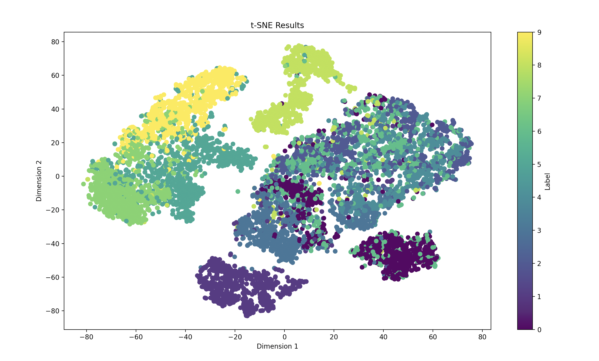

# Dimensionality Reduction

Dimensionality reduction serves as the means to take a dataset, $XY$ and reduce it's dimensionality down to a point where it is more manageable and computationally efficient.

If $XY$ is shape $(n, p)$, where $n$ is the number of samples and $p$ is the number of features within a given sample (row) vector, the goal of dimensionality reduction is to reduce $XY$ to size, $(n, k)$ such that $k$ features are < $p$ and become more manageable for a computer to work with.

You'll always lose some data when performing dimensionality reduction, but in the right situation, it can be invaluable. The goal is to reduce a given dataset $XY$ to the smallest dimensionality possible, the smallest size $k$ while minimizing the loss of quality of data in $XY$.

You can do so via Linear Reduction or non-linear reduction (akin to [manifold learning](https://prateekvjoshi.com/2014/06/21/what-is-manifold-learning/)).

Non-Linear reduction can be divided into local and global techniques, where local looks purely at the nearest neighbor of a given $x_i$ while global techniques look at the entire dataset (which t-SNE, can become global if we consider all nearest neighbors, where perplexity, $P = samples$, as we begin to consider the entire dataset from a global perspective, rather tha a local one)

An example of linear reduction is $PCA$ while an example of non-linear reduction is $t-SNE$

### Curse of Dimensionality

The curse of dimensionality refers to the challenges and that arise when dealing with data vectors of high idmensinonality, where a single sample has an overwhelmingly number of features.

As the dimensionality, $n$, increases for a given dataset:

1. Distance metrics, such as the euclidean distance ($L2$), become unreliable. The $L2$ becomes increasingly large but also becomes uniform accross all data points.
2. Computational Complexity for certain algorithms become exponentially large.
3. Datapoints can become sparse, leading to difficulty in finding meaningful patterns accross different datapoints.

But with the curse of dimensionality, comes a *blessing of non-uniformity* which refers to that in-practice, the important features of real-world datasets aren't spread uniformly and instead are more concentrated into specific areas while the rest are non-essential features.

> *Images of faces are a good example, where the more important features are the eyes, nose, mouth, etc, not the shoulders nor backdrop of the image*

Therefore, we can reduce the dimensionality to purely include these important features and disregard the non-important features.

### Vector Projections

Vector projection is a technique where we take a vector, say $\vec{v}$, and project it onto another vector $\vec{u}$. It measures the amount by which a given vector goes in direction of another vector. When $\vec{v}$ is smaller than $\vec{u}$, the projection of $\vec{v}$ onto $\vec{u}$ is a portion of $\vec{u}$, representing the component of $\vec{v}$ that goes in direction of $\vec{u}$.

> Of course, otherwise the projected vector would be larger than vector **u** which works fine as well.

- If $\vec{v}$ and $\vec{u}$ are orthogonal, the projection of $\vec{v}$ onto $\vec{u}$ is essentially $0$.

Say $\vec{p}$ is the projected vector from $\vec{v}$ to $\vec{u}$ where $\vec{p} = k\vec{u}$ and $k$ is a scalar multiplier of $\vec{u}$.

- The $\vec{p}$ can be described this way as the projected vector must be going in the same direction as $\vec{u}$

Finding $\vec{p}$ is then a matter of finding the scalar $k$.

This can be done as:

$k = \frac{\vec{v} \cdot \vec{u}}{||\vec{u}||^2}$

where $||\vec{u}||^2$ is the squared euclidean norm of $\vec{u}$.

> *Note that a dot product tells us how much a vector aligns with another.*
> 
> *In the above, v • u tells us how much v aligns with u*

and to get the final projection, we multiply it by $\vec{u}$:

$p = k\vec{u}$

Doing so reduces the dimensionality of the datapoints, which can prove to be useful computationally if dealing with complex datasets.

### Eigenvalues & Eigenvectors

An Eigenvector of a matrix $A$, is any vector $\vec{x} \in \mathbb{R}$ where $\vec{x} ≠ \vec{0}$  that when multiplying a matrix $A$ by $\vec{x}$ you get back a scalar multiple of vector $\vec{x}$ where the multiplier of $x$ is $\lambda$, which $\in \mathbb{R}$.

$A\vec{x} = \lambda \vec{x}$

The scalar multiplier, $\lambda$, is called the eigenvalue

Again -- eigenvalues $(\lambda)$ are the scalar multipliers of a vector $\vec{x}$ that give back the corresponding multiple of the eigenvector.

To find the eigenvector:

1. $A\vec{x} = \lambda\vec{x}$
2. $A\vec{x} = \lambda I\vec{x}$
3. $A\vec{x} - \lambda I \vec{x} = 0$
4. $\vec{x}(A - \lambda I) = 0$
5. $det(A - \lambda I ) \rightarrow polynomial$
6. $polynomial_{roots} \rightarrow \lambda \hspace{1mm} (eigenvalue / lagrange \hspace{1mm} multiplier)$
7. Plug $\lambda$ back into $A\vec{x} = \lambda \vec{x}$ and solve the system of equations to get the eigenvectors
8. Verify answer.

$A\vec{x} = \lambda\vec{x}$

where:

- $\vec{x} ≠ \vec{0}$
- $\lambda \in \mathbb{R}$

Note that for an Eigenvector to exist, $det(A - \lambda I)$ must equal $0$ 

### Lagrange Multipliers

Given a function we want to maximize or minimize, Lagrange multipliers are the scalar multipliers that denote the maximum or minimum of a given function, under a specified constraint.

$L(X, \lambda) = f(x) + \lambda(g(x))$

where $\lambda$ is the Lagrange Multipliers, $f(X)$ is the original function we're trying to maximize or minimize, and $g(x)$ is our constraint.

**In Linear Algebra**

1. Take the derivative of $L(x, \lambda)$, see that you can compute the Lagrange as the maximum or minimum Eigenvalue
2. Find the Eigenvalue
3. The largest Eigenvalue is the Lagrange multiplier which corresponds to the maximum possible value of $f(x)$. The inverse is true for the minimum.

### Covariance and the Covariance Matrix

Covariance measures how much 2 variables change together, quantifying the degree to which changes in 1 variable, $X$, are correlated with the same changes in $Y$.

$Cov_{population}(X, Y) = \frac{1}{N} \sum_{i=1}^N (X_i - \mu_X)(Y_i - \mu_Y)$

$Cov_{sample}(X, Y) = \frac{1}{n-1} \sum_{i=1}^n (X_i - \mu_X)(Y_i - \mu_Y)$

If $X$ and $Y$ are both extremely positive or extremely negative, then they have a high degree of covariance. Otherwise, if $X$ is extremely positive and $Y$ is extremely negative, they have a very low covariance.

The covariance of a variable with itself, say $X$ as $Cov(X, X)$ is simply $Var(X)$.

A Covariance matrix for given vectors, $X$ and $Y$:

$X = \begin{bmatrix} 2, 4, 6, 8 \end{bmatrix}$
$Y = [5, 9, 7, 10]$ 

is found as:

$\bar{X} = \frac{2 + 4 + 6 + 8}{4} = 5, \quad \bar{Y} = \frac{5 + 9 + 7 + 10}{4} = 7.75$

$\text{Cov}(X, X) = \frac{1}{n-1} \sum_{i=1}^{n} (X_i - \bar{X})^2 = \frac{1}{3} \left[(2 - 5)^2 + (4 - 5)^2 + (6 - 5)^2 + (8 - 5)^2 \right] = \frac{1}{3} \left[9 + 1 + 1 + 9 \right] = \frac{20}{3} \approx 6.67$

$\text{Cov}(X, Y) = \frac{1}{n-1} \sum_{i=1}^{n} (X_i - \bar{X})(Y_i - \bar{Y}) = \frac{1}{3} \left[(2 - 5)(5 - 7.75) + (4 - 5)(9 - 7.75) + (6 - 5)(7 - 7.75) + (8 - 5)(10 - 7.75) \right] = \frac{13}{3} \approx 4.33$

$\text{Cov}(Y, Y) = \frac{1}{n-1} \sum_{i=1}^{n} (Y_i - \bar{Y})^2 = \frac{1}{3} \left[(5 - 7.75)^2 + (9 - 7.75)^2 + (7 - 7.75)^2 + (10 - 7.75)^2 \right] = \frac{14.75}{3} \approx 4.92$

$\text{Covariance Matrix} = \begin{bmatrix} \text{Cov}(X, X) & \text{Cov}(X, Y) \text{Cov}(Y, X) & \text{Cov}(Y, Y) \end{bmatrix} = \begin{bmatrix} 6.67 & 4.33 \\ 4.33 & 4.92 \end{bmatrix}$

Covariance Matrix is symmetric, it's transpose is equal to itself

The closed form of the Covariance matrix is the form which can be determined by a deterministic formula:

$Cov(X, Y) = \frac{1}{N-1} \sum_{k=1}^N(X_k - \bar{X})(Y_k - \bar{Y})^T$ 

where $X_k$ and $Y_k$ are the individual $k$-th samples of $X$ and $Y$.

You can also take the covariance of a matrix $X$ with itself with the same formula as:

$Cov(X, Y) = \frac{1}{N-1} \sum_{k=1}^N(X_k - \bar{X})(X_k - \bar{X})^T$ 

which will be important for Principal Component Analysis.

### Manifold Learning

A manifold is a shape or a topological space, a mathematical structure where it's local space near a given point, say $a$, can be navigated via euclidean distance metrics.

It can be considered as an extension to the euclidean space, allowing for a variety of different interpretations of a given space rather than purely relying on euclidean metrics.

A 1 dimensional manifold can be a line or a circle while 2 dimensional manifolds can be spheres or planes.

A succesful manifold learning algorithm aims to reduce data belonging to a higher dimensional manifold onto a lower dimensional manifold.

## Principal Component Analysis

Principal Component Analysis is the means for reducing the dimensionality of a dataset, say ${X_k}, k \in [1, ..., N]$ with dimensionality $D$ to dimensionality $M$ where $M < D$.

Essentially, it answers, *"How do we reduce the dimensionality of a set of samples?"*.

It aims to maximize the preservation of the original variation of $x_k$ with dimensionality $D$, while compressing $x_k$ down to dimensionality $M$, again where $M < D$.

PCA wants to find the direction at which the variance has the maximum direction.

If $V$ is a principal component, the variance of dataset $X$ projected onto $V$ is given as:

$Variance = \frac{1}{N} \sum_{k=1}^N(V^TX_k - V^T\bar{X})^2$

$Variance = V^T(\frac{1}{N} \sum_{k=1}^N(X_k - \bar{X})^T(X_k - \bar{X}))V$

$Variance = V^TCV$

where $C$ turns to be the covariance matrix and can be simply calculated as $X_{meancentered}^TX_{meancentered}$

We want to maximize $V^TCV$ subject to $||V|| = 1$

This is done through Lagrange Multipliers, $\mathcal{L}(x, \lambda)= f(x) + \lambda g(x)$, where $g(x)$ is the constraint, $1 - ||V||$,and $f(x)$ is the function we want to maximize, in this case the variability of the projection $V$ onto $X$, $f(x) = V^TCV$.

$\mathcal{L}(x, \lambda)= V^TCV + \lambda (1 - ||V||)$

We take the derivative as:

$\frac{∂\mathcal{L}}{∂v} = 2CV - 2\lambda V$

and then simplify to:

$2CV = 2\lambda V$ 
$CV = \lambda V$ (eigenvector / value problem) 
$CV = \lambda I V$, where $I$ is the identity matrix. 
$CV - \lambda IV = 0$ 
$V (C - \lambda I) = 0$

Where now we want to find the $det()$ of $C - \lambda I$, which will result in a polynomial.

We then find the roots of this polynomial to find the largest eigenvalue ($\lambda$) which corresponds to the Lagrange Multiplier that maximizes the the variability of the projected data whilst having the constraint of $||V|| = 1$.

This Lagrange Multiplier is used to then find the eigenvector which serves as the principal component $(P)$ for reducing the dimensionality of the original data vector, $X_k$

To reduce it, all we do is apply a Vector Projection as:

$K = \frac{X_iP_i}{||P_i||^2}$ 
$X_{iPCA} = P_iK$ 

where $i$ denotes the $ith$ data vector and $ith$ principal component and where $K$ is the multiplier of the principal component $P$ where their multiplication represents the projection of the vector $X$, as $X_{iPCA}$.

Or it can be simply expressed as a dot product of the entire matrices $X$ with $P$,

$X_{PCA} = XP$

To evaluate how much each $P$ captures the variability from the original data and preserves it's structure, you can take a look at the corresponding $\lambda$ (eigenvalues) of each principal component and compute as:

$\frac{\lambda}{\sum_k^K \lambda}$

where you divide indivual eigenvalues over all eigenvalues summed, to get the ratio of variability captured by a given $\lambda$ to total variability.

You can capture this over multiple $r$ $\lambda$'s as:

$\frac{\sum_{r=1}^R \lambda}{\sum_{k = 1}^K \lambda}$

where $R$ are the total number of principal components you want to consider, to determine how much variability your $R$ principal components captures relative to the original dataset.

>*This is as each eigenvalue is a measure of variability of the orig. dataset.*

In practice, when reducing the total number of features / dimensionality of a dataset,

- The number of dimensions $=$ number of features
  - You want to reduce the number of features to `n_components`, whilst keeping the "important" ones.
- The matrix, $V$, should be shape of (`samples`, `n_components`) if the original $X$ was shape (`samples`, `features`). Vice versa.
- The row of the matrix, $V$, as $V_k$ should be orthonormal, meaning each row is orthogonal to another and the $L_2$ norm / magnitude of each row is equal to $1$, signalling a unit vector.

> *PCA was confusing to me at first. If it still is for u, check [this out](https://www.youtube.com/watch?v=dhK8nbtii6I&t=442s).*

## t-Distributed Stochastic Neighbor Embedding

### Manifold Learning

t-SNE is a means of manifold learning, where it aims to estimate a the lower dimensional manifold from the higher dimensional manifold of a dataset.

While PCA used the euclidean distance as it's distance metric, in higher dimensions, it becomes unreliable.

If you consider a higher dimensional manifold, it's probable that the euclidean distance between a given $a$ and $b$ will not be true to its geodesic distance.

To properly reduce samples to a lower dimensional manifold, we'd want to appropriately account for their true distance relevant to their nearby neighbors. Accounting for purely euclidean distance can misconstrue what the nearby neighbors really are.

Though, $t-SNE$ still does make use of the euclidean distance, it does so in a non-linear manner given that it's stochastic and doesn't rely on eigenvalues or any other form of linear transformations as $PCA$ does.

$PCA$ automatically reduces datapoints in a linear fashion via the nearest eigenvalues $(\lambda)$ while $t-SNE$ relies on similarity metrics that allow it to capture more individual nuances.

### Radial Basis Function

The radial basis function computes the similarity between two given datapoints, based on their distance.

$K(x, y) = e^{-\frac{||x - y||^2}{2\sigma^2}}$

where:
-  $||x - y||$ is the Euclidean Distance between $x$ and $y$
- $\sigma$ is the parameter that controls the width of the gaussian function.

The kernel value, $K$, decreases as the distance between $x$ and $y$ increases, indicating that they aren't similar.

Inversely, a higher similarity yields a higher $K$.

As $\sigma$ decreases, the similarity measure becomes less sensitive to distance, points that are further apart will still have higher similarity scores compared to when $\sigma$ is a lower value.

The gradient of the exponential decay in the RBF kernel will be lower when $\sigma$ is higher, and conversely, higher when $\sigma$ is smaller.

### Student's t-Distribution

Student's t-Distribution that serves as a means of modeling data without knowing the population standard deviation $\sigma$ and instead relies purely on the data. This will be useful for $t-SNE$, as it aims to predict the representation of the underlying manifold without knowing it's $\sigma$ or $\sigma^2$

It's PDF is defined as:

$\frac{\Gamma(\frac{v+1}{2})}{\sqrt{\nu\pi}\Gamma(\frac{\nu}{2})}(1 + \frac{t^2}{\nu})^{-\frac{\nu + 1}{2}}$

where $\frac{\Gamma(\frac{v+1}{2})}{\sqrt{\nu\pi}\Gamma(\frac{\nu}{2})}$ is the normalization constant, ensuring that the integral of the entire area under the distribution is equal to $1$, and $(1 + \frac{t^2}{\nu})^{-\frac{\nu + 1}{2}}$ is the function itself that draw the bell curve.

### Algorithm

Say we have $n$ datapoints where $n$ is an arbitrary high dimension, $x_i \in \{x_1, x_2, ..., x_n\}$

Given $x_i$, what is the probability that $x_j$ is its neighbor?

An easy way to do this is to use an algorithm, $\mathbb{A}$, similar to a K-Nearest-Neighbors Classifier, by computing a function, $g(x_i)$, to determine the shortest distance between the given $x_i$ and all possible $x_j$, given by $||x_i - x_j||^2$ (euclidean distance squared) to return the the probability of a given $x_i$ belonging to $x_j$.

$P_{j|i} = g(x_i)$

where $P_{j|i}$ is the probability that $x_j$ is the nearest neighbor to a given $x_i$.

The issue with this is that as dimensions, $n$, continues to increase, computing neighbors as the nearest euclidean distance becomes unreliable as each datapoint $x_j$ essentially becomes near equidistant to each other[^1]

Instead, you can compute a function that uses the nearest distance between $x_i$ and $x_j$, $d_{ij} = g(x_i)$ and the distances of the given $x_i$ to all other possible values $x_{k≠j}$, $d_{ik}$ for a more precise calculation of the true $k$ nearest neighbors.

$P_{j|i} = f(d_{ij}, d_{ik})$

where $P_{j|i}$ is the probability that $x_j$ is the nearest neighbor to a given $x_i$.

> *A type of similarity metric*

This function, $f$, can be defined as:

$P_{j|i} = \frac{e^\frac{-||x_i-x_j||^2}{2\sigma^2}}{\sum_{k≠i} e^{-\frac{||x_i - x_k||^2}{2\sigma^2}}}$

where the numerator and the term being summed in the denominator is the Radial Basis Function $(RBF)$, where the output of the is RBF higher if there is a higher similarity between 2 datapoints, in this case $x_i$ and $x_j$, and the inverse is a lower similarity.

The $\sigma$ value, akin to the standard deviation, can be adjusted to increase or decrease the width of the individual bell curve given by the $RBF$. Increasing $\sigma$ will adjust the region of similarity of the $RBF$, to a more wider scale. 

As $\sigma$ decreases, the similarity measure becomes less sensitive to distance, points that are further apart will still have higher similarity scores compared to when $\sigma$ is a lower value.

In $f$, we can allow the $\sigma$ to be dynamic, allowing the entire function to capture different nearest neighbors for a given $x_i$. If the nearest neighbors as so far apart from $x_i$, such that the nearest neighbors end up in a region of dissimilarity for the $RBF$, the similarity and then the probability measures of $x_i$ belonging to $x_j$ would be low despite then being near neighbors compared to other datapoints.
 
Dynamically increasing $\sigma$ or decreasing it, allows for us to dynamically capture the similarity for different sets of $x_i$ and it's nearest neighbors.

This can be done through a perplexity $(Perplexity)$ parameter, which essentially increases or decreases the $\sigma$ allowing a given gaussian distribution to effectively capture different number of nearest neighbors, as needed.

Higher perplexity values allow for each point to consider more distant points as neighbors while lower perplexity focuses more on closer neighbors.

If the perplexity value is too high, the algorithm, $\mathbb{A}$ will consider more neighbors. This can be beneficial when the data vectors of different classes are clearly separate across the given $\mathbb{R}^n$ space, but if they data vectors aren't clearly spread out, it may cause blurring in the reduced dataset.

It's good to have a higher perplexity value when the boundaries of different classes in your dataset is clear-defined, in the given $\mathbb{R}^n$ space as tSNE will be able to more adequately seperate your data.

</img> 
<em>t-SNE on MNIST, perplexity = 30. Not so good results on my end.</em>

 

For a given perplexity value, the goal of the algorithm, $\mathbb{A}$, is to find the appropriate $\sigma_i$, where $i$ is the $ith$ sample, such that $Perp(P_i) = Perplexity$, where $Perp(P_i) = 2^{H(P_i)}$.

$H(P_i)$ refers to the entropy of the distribution $P_{ij}$, defined as:

$H(P_i) = -\sum_{j≠i} P_{j|i} \cdot log P_{j|i}$

So you can adjust $\sigma$ until we get the $\sigma$ value that yields $Perp(P_i) = Perplexity$. This is typically found via binary search.

So, you can see the entire function $P_{j|i}$ as a probability measure of a given $x_i$ and $x_j$ being neighbors compared with all other possible datapoints, $x_k$.

Now using that function, to compute the probability of drawing $x_i$ and $x_j$ if we pick a point at random, we can do so as:

$P_{ij} = \frac{P_{j|i} + P_{i|j}}{2N} = \frac{P_{j|i}}{N}+\frac{P_{i|j}}{N}$

We use both probabilities, $P_{j|i}$ and $P_{i|j}$ to symmetrically consider the probability as a whole. Given that $x_i$ and $x_j$ are different datapoints in an $\mathbb{R}^n$ vector space, their different positions would account for different probabilities.

We want to get both of their probabilities, to then compute a more overarching view of the similarity measure, $P_{ij}$.

So, the goal of t-SNE becomes to learn lower dimensional representations of each datapoint $x_i$, which we'll denote as $y_i \in \{y_1, y_2, ..., y_n \}$ such that the probability, $P_{ij}$, remains preserved between the given $x_i$ and $x_j$ when each $x$ is mapped to lower dimensional data vectors, $y$.

If the probability of $x_1$ and $x_2$ was set to $.5$, then we'd want the similarity between $y_1$ and $y_2$ to be as near to $.5$ as is possible.

So we could get the similarity metric of a given $y_i$ and $y_j$, denoted as $Q_{ij}$, the same way as prior. Then what should be left is to compare and make sure that the similarity metric, $Q_{ij}$ and $P_{ij}$ are near equivalent.

But the issue with this is that this can become erroneous as the dimensionality of a given space begins to increase[^1]. If we denote $V_{near}$ as the volume of the  nearby region while $V_{moderate}$ as the volume of the region further from $x_i$, the volume of $V_{moderate}$ increases at a faster rate than $V_{near}$, leading the ratio, $V_{near}:V_{moderate}$ to have an increasingly high value as we increase the dimensionality of our vectorspace.

But when we try to reduce $V_{moderate}$ into a lower dimensional space, there just isn't as much room to preserve the variability of $V_{moderate}$, such that you're forced to pack datapoints very tightly and the fidelity of the data diminishes.

The probability $P_{ij}$ and it's function, turns out to be inadequate to mitigate this issue brought by the curse of dimensionality. This is as for $V_{moderate}$, despite being moderately close, the small tail of the distribution will still end up classifying moderately far datapoints with higher dissimilarity, as regions that are $V_{far}$.

Instead we can use a distribution that has a fatter tail, allowing for $V_{moderate}$ datapoints to have an adequate probability with respect to $x_i$. This can be done using Student's t-distribution with a degree of freedom equalling $1$, to then compute $Q_{ij}$ in an improved manner.

$Q_{ij} = \frac{(1 + ||y_i - y_j||^2)^{-1}}{\sum_{k≠i}(1+||y_i - y_k||^2)^{-1}}$

where the numerator is the probability density function $(PDF)$ for student's t-distribution as well as the summed denominator.

> *Note that we only compute Q, for matrix that was reduced into a lower dimensionality. For the original, we compute P.*

Then as a metric to compare the final probability distributions, $Q_{ij}$ and $P_{ij}$, we can use the $KL$ Divergence, to ensure that the probability of $x_j$ given $x_i$ remains relatively the same as we reduce dimensionality.

The $KL$ then serves as a type of metric (loss), to denote how erroneous the algorithm is, which can then be minimized via gradient descent.

If we initialize random vectors in a lower dimensional space as $y_i$, where $i$ is the $ith$ reduced sample, gradient descent can be computed as:

$y_i^{t+1} = y_i^t + \eta \frac{∂KL}{∂y_i}$

where $\eta$ is the learning rate and $\frac{∂KL}{∂y_i}$ is the derivative of the loss, $KL$, with respect to a given hypothesis vector for the reduced sample $y_i$.

Then, the entire process of $t-SNE$ is as:

1. Compute conditional probabilities, $P_{j|i} = \frac{e^\frac{-||x_i-x_j||^2}{2\sigma^2}}{\sum_{k≠i} e^{-\frac{||x_i - x_k||^2}{2\sigma^2}}}$
2. Iteratively adjust $\sigma$ in $P_{j|i}$ such that $Perp(P_i) = 2^{H(P_i)}$ becomes equivalent to $Perplexity$, through binary search
3. Compute the final $P_{j|i}$ based on the optimized $\sigma$ value.
4. Compute $Q_{ij} = \frac{(1 + ||y_i - y_j||^2)^{-1}}{\sum_{k≠i}(1+||y_i - y_k||^2)^{-1}}$
5. Compute $KL$ divergence, $KL = \sum_i P(i) \cdot log(\frac{P(i)}{Q(i)})$ as the loss metric
6. $min(KL)$ using gradient descent.

[^1]: Curse of Dimensionality
